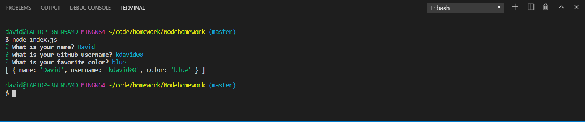

# Table of Content

- [Description](#Description)
- [User-Story](#User-Story)
- [Educational-Context](#Educational-context)

# Nodehomework

## Description

 Create a command-line application that dynamically generates a PDF resume from a GitHub username.

## User-Story

AS A product manager

I WANT a developer profile generator

SO THAT I can easily prepare reports for stakeholders

## Educational-context

When preparing a report for stakeholders, it is important to have up-to-date information about members of the development team. Rather than navigating to each team member's GitHub profile, a command-line application will allow for quick and easy generation of profiles in PDF format.

Finished product

##  created by

- Kondali Kangha